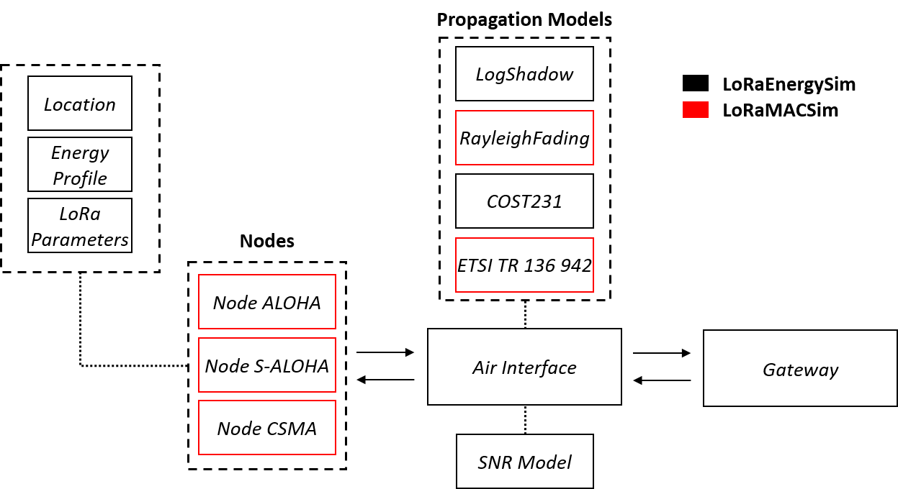

# LoRaMACSim
LoRaMACSim consists of a stand-alone modification to the LoRaEnergySim [1] python simulator for LoRa networks. 
LoRaMACSim allows to simulate Aloha, slotted Aloha and CSMA/CA channel access for a single gateway LoRa network.




## Differences compared to LoRaEnergySim?
LoRaMACSim's framework is similar to LoRaEnergySim, however it includes new behaviours for the channel access of the nodes and new propagation models.   
"\Framework\" contains all the source file of the simulator;
"\Simulations\" contains the files describing the simulation scenaris (parameters, nodes location, etc. )
"\Simulations\Results" within this folder all the results of a simulation are saved in pickle files

### Instructions to run the simulator
 1) Modify the configuration and parameter for the simulation specified in these files:
  - "LoRaMACSim\Simulations\GlobalConfig.py"
  - "LoRaMACSim\Simulations\multi_MAC_simulation_config\simscript_parallel.py"
  - "LoRaMACSim\Simulations\multi_MAC_simulation_config\SimulationProcess.py"
 
 2) From "LoRaMACSim\Simulations\multi_MAC_simulation_config\", start the simulation by running "simscript_parallel.py"
  ```python 
  python ./simscript_parallel.py
 ```
 3) The results of the simulation will be saved in pickle file inside the "LoRaMACSim\Simulations\Results" folder.
    If you want to import the results in Matlab you can use the function "LoRaMACSim\Simulations\Results\loadpickle.m"

#### Configurable Properties
+LoRaEnergySim
 - energy_profile: EnergyProfile, 
 - lora_parameters, 
 - process_time, 
 - adr, 
 - location,
 - payload_size,  
 - confirmed_messages=True

+LoRaMACSim
  - TX_Intervall: transmission interval of the nodes
 Slotted Aloha
  - std_jitter: synchronization ucnertainty
  - guard_times: timeslots guard time
 CSMA/CA
  - cad_time: duration of a CAD (LBT)


#### What is avaible in the pickle files
 - Packets_received: total number of packets correctly received by the GW,
 - Packets_received_per_node: number of packets correctly received by the GW for each node,
 - Weak_packets: total number of weack packets (i.e, below SNR) wich failed to be received, 
 - Avg_packet_sent: average number of packets sent by each node, 
 - Avg_collided_packet: average number of packets collided wich failed to be received, 
 - Nodes_locations: location of each node during the simulation.

 
 [1] G. Callebaut and G. Ottoy and L. van der Perre, "Cross-Layer Framework and Optimization for Efficient Use of the Energy Budget of IoT Nodes,." In 2019 IEEE Wireless Communications and Networking Conference (WCNC), 2019, pp. 1-6  
